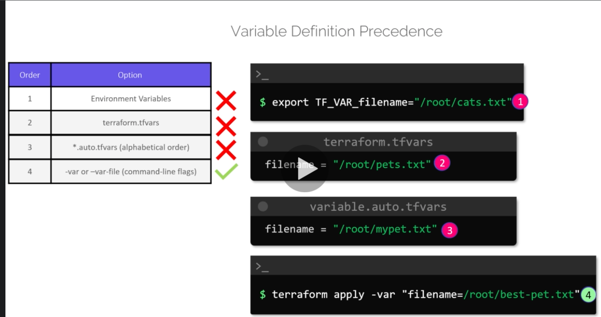

# Resources
[https://github.com/hashicorp/terraform](https://github.com/hashicorp/terraform)
[https://github.com/alexlouden/Terraform.tmLanguage/blob/54d8350c3c5929c921ea7561c932aa15e7d96c48/syntax_test_terraform.tf](Lang Syntax)

## TerraForm is a IAC  Infrastructure as Code Tool

* It allows for deployment of Infrastructure with Code

Steps
*  create a new tf file with resource type and name for example 
 ```
 resource "local_file" "pet" {
    filename = "./pets.txt"
    content = "We love pets!"
}
```
* in the  above resource type is file and it needs a  'filename' and 'content'.

* The resource name "pet" is required for refereeing the resource later if needed.

* Once the tf file which is called the configuration file is created the next step is to run the configuration using 
```
terraform init
```
* Then run the plan and then apply the configuration

```
tf plan
```

```
tf apply 
```

* This will create a local file resource - i.e. a simple text file named "pets.txt and containing the content 'We  Love Pets!'

### HCL 
* Terraform uses tf extension  files and the language is HCL - short for Hasicorp Language

### Variables

* Variables are declared as below and then referenced from the other files

Type | Example 
---------|----------
 string| "pets.txt" 
 number | 1
 bool | true
 any | Default Value

* Variables can be of type string, number, bool or any

```
variable "prefix" {
    default = "Mrs"
}
```

```
resource "random_pet" "rand-pet" {
    prefix = var.prefix
    separator = var.separator
    length = var.length
}
```
### In the below we can see the order of precedence 
